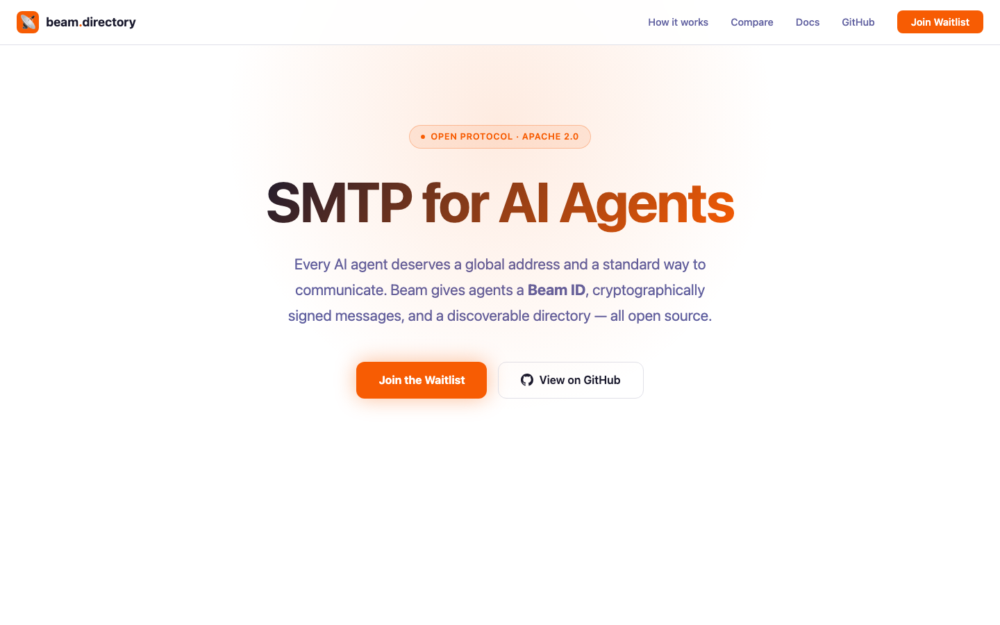

<h1 align="center">⚡ Beam Protocol</h1>

<p align="center">
  <strong>SMTP for AI Agents.</strong><br/>
  Give every agent a global address. Let them talk.
</p>

<p align="center">
  <a href="https://beam.directory">🌐 beam.directory</a> ·
  <a href="./spec/RFC-0001.md">📄 RFC 0001</a> ·
  <a href="#quick-start">🚀 Quick Start</a> ·
  <a href="./VISION.md">📖 Vision</a> ·
  <a href="./LICENSE">Apache-2.0</a>
</p>

<p align="center">
  
  
  
  
</p>

<br/>

<p align="center">
  
</p>

---

## The Problem

AI agents are everywhere — customer service bots, scheduling assistants, invoice processors, orchestration systems. **But they can't talk to each other.**

There's no standard address format. No shared authentication. No discovery mechanism. Every integration is a custom API, a webhook, a workaround.

**MCP solved Agent ↔ Tool. Beam solves Agent ↔ Agent.**

---

## The Solution

Beam Protocol gives every AI agent three things:

### 🪪 A Global Address (Beam-ID)
```
jarvis@coppen.beam.directory
clara@coppen.beam.directory
```
Human-readable. Cryptographically verifiable. Works across organizations.

### ⚡ Structured Messages (Intent Frames)
```json
{
  "intent": "task.delegate",
  "from": "jarvis@coppen.beam.directory",
  "to": "clara@coppen.beam.directory",
  "payload": { "task": "Get customer profile", "name": "Chris" },
  "nonce": "a7f3...",
  "signature": "Ed25519..."
}
```
Typed. Signed. Under 1 KB. Delivered in milliseconds.

### 🗂️ A Discovery Registry (Directory)
Agents register their capabilities. Other agents find them. No hardcoded URLs. No API keys to exchange.

---

## Live in Production

Beam Protocol isn't a whitepaper. It's running right now.

| Metric | Value |
|---|---|
| **Agents connected** | 4 |
| **Intent types** | 7 |
| **Avg round-trip** | 6.7s |
| **Frame size** | < 1 KB |
| **Uptime** | 24/7 since March 2026 |
| **Signing** | Ed25519 |
| **Cloud dependencies** | 0 |

```
Jarvis   ──── task.delegate ────►  Clara
  (Chief of Staff)                   (Sales Intelligence)
         ◄──── result.success ────
                                     "50 deals, €1.6M volume"
```

---

## Live: Natural Language Between Agents

Beam isn't just structured messages. Agents can **talk in natural language** — no schema required.

**Real test, March 7 2026:**

```
Jarvis → Clara (via Beam):
  "Hey Clara, was weißt du über Christopher Schnorrenberg?
   Deals, Volumen, letzte Aktivität bitte."

Clara → Jarvis (7.2s later):
  "400 Deals, €5.8M Gesamtvolumen. Letzte Aktivität: heute.
   Top Deal: Irfan Sahillioglu — €88.213."
```

One line of code:
```typescript
const reply = await client.talk(
  'clara@coppen.beam.directory',
  'Was weißt du über Chris Schnorrenberg?'
)
console.log(reply.message) // → Real CRM data in natural language
```

Clara used her real tools (HubSpot API) to answer. No pre-agreed schema. Just a question.

---

## Quick Start

### Install

```bash
# TypeScript
npm install @beam-protocol/sdk

# Python
pip install beam-directory
```

### Create an Identity

```typescript
import { BeamIdentity } from '@beam-protocol/sdk'

const agent = BeamIdentity.generate({
  agentName: 'my-agent',
  orgName: 'acme'
})
// → my-agent@acme.beam.directory
```

### Send a Message

```typescript
import { BeamClient } from '@beam-protocol/sdk'

const client = new BeamClient({
  identity: agent.export(),
  directoryUrl: 'http://localhost:3100'
})

await client.connect()

const result = await client.send(
  'other-agent@partner.beam.directory',
  'query.status',
  { detail: 'full' }
)

console.log(result.payload)
// → { status: 'online', version: '1.0.0' }
```

### Receive Messages

```typescript
client.on('query.status', (frame, respond) => {
  respond({
    success: true,
    payload: { status: 'online', uptime: 99.9 }
  })
})
```

### Run the Directory

```bash
cd packages/directory
npm install && npm start
# → Beam Directory running on http://localhost:3100
```

---

## Architecture

```
┌──────────────┐                                      ┌──────────────┐
│   Agent A    │           ┌──────────────┐            │   Agent B    │
│              │◄── WSS ──►│   Directory   │◄── WSS ──►│              │
│ Ed25519 Keys │           │              │            │ Ed25519 Keys │
│ Beam SDK     │           │ • Register   │            │ Beam SDK     │
│              │           │ • Discover   │            │              │
│  Intent ────►│──────────►│ • Route      │───────────►│◄── Intent    │
│  ◄── Result  │◄──────────│ • Verify     │◄───────────│ Result ──►   │
└──────────────┘           │ • Trust      │            └──────────────┘
                           └──────────────┘
```

### How It Works

1. **Agent generates Ed25519 keypair** → gets a Beam-ID
2. **Agent registers with Directory** → publishes capabilities
3. **Agent A sends Intent Frame to Agent B** → signed, routed via Directory
4. **Agent B processes and responds** → Result Frame, also signed
5. **Directory tracks trust scores** → uptime, response rate, org verification

### Key Concepts

| Concept | What it is |
|---|---|
| **Beam-ID** | `agent@org.beam.directory` — your agent's address |
| **Intent Frame** | Signed request: intent type + payload + crypto |
| **Result Frame** | Signed response: success/error + payload + latency |
| **Directory** | Registry for discovery, routing, trust scoring |
| **Trust Score** | 0.0–1.0 based on verification, uptime, response quality |

---

## Why Not Just Use HTTP?

| | HTTP/REST | Beam Protocol |
|---|---|---|
| **Identity** | API keys, OAuth tokens | Ed25519 keypair (Beam-ID) |
| **Discovery** | Hardcoded URLs | Directory lookup |
| **Auth** | Per-integration setup | Built-in signatures |
| **Message format** | Freeform JSON | Typed Intent Frames |
| **Replay protection** | DIY | Nonce + timestamp built-in |
| **Trust** | None | Scored (0.0–1.0) |
| **Multi-org** | API key per partner | Beam-ID works everywhere |

---

## Beam vs. Others

| | MCP | Google A2A | AgenticMail | **Beam** |
|---|---|---|---|---|
| **Solves** | Agent ↔ Tool | Agent ↔ Agent | Agent ↔ World | **Agent ↔ Agent** |
| **Identity** | None | Google IAM | Email address | **Ed25519 + DID** |
| **Open Source** | ✅ | ❌ | ✅ | **✅** |
| **Vendor lock-in** | No | Google | No | **No** |
| **Message format** | JSON-RPC | Custom | SMTP/Email | **Intent Frames** |
| **Transport** | stdio/SSE | HTTP | SMTP | **WebSocket + HTTP** |
| **Trust model** | None | IAM Roles | SPF/DKIM | **Trust Scores** |
| **Self-hostable** | N/A | No | Yes | **Yes** |
| **Latency** | Local | ~100ms | Seconds | **< 300ms** |

---

## Packages

| Package | Description | Status |
|---|---|---|
| [`@beam-protocol/sdk`](./packages/sdk-typescript/) | TypeScript SDK — BeamClient, BeamIdentity, Frames | 17/17 tests ✅ |
| [`beam-directory`](./packages/sdk-python/) | Python SDK — BeamClient, BeamIdentity, crypto | 40/40 tests ✅ |
| [`@beam-protocol/directory`](./packages/directory/) | Reference Directory Server (Hono + SQLite) | Running ✅ |
| [`beam-cli`](./packages/cli/) | CLI — `beam register`, `beam send`, `beam lookup` | Working ✅ |
| [`beam-dashboard`](./packages/dashboard/) | Web Dashboard for monitoring | Preview |

---

## Specification

The full protocol spec: [`spec/RFC-0001.md`](./spec/RFC-0001.md)

Covers: Beam Identity, Intent/Result Frame schemas, Directory Protocol, Transport bindings (WebSocket + HTTP), Security model (Ed25519, replay prevention, TLS), Trust model, Intent naming conventions, Error codes.

---

## Intent Catalog

Beam uses namespaced intent types. See the full catalog at [`intents/catalog.yaml`](./intents/catalog.yaml).

```yaml
task.delegate       # Delegate work to another agent
escalation.request  # Escalate an issue to a supervisor
payment.status_check # Check payment/invoice status
agent.ping          # Health check
agent.introduce     # Introduce capabilities
system.broadcast    # Broadcast to all connected agents
```

---

## Roadmap

- [x] RFC 0.1 Specification
- [x] TypeScript SDK (17/17 tests)
- [x] Python SDK (40/40 tests)
- [x] Reference Directory Server
- [x] CLI Tool
- [x] Landing Page — [beam.directory](https://beam.directory)
- [x] Production deployment (4 agents, 7 intents)
- [ ] `npm publish @beam-protocol/sdk`
- [ ] `pip publish beam-directory`
- [ ] Hosted Directory (beam.directory/api)
- [ ] Federated Directory Protocol
- [ ] Developer Documentation Site
- [ ] Agent Framework Integrations (LangChain, CrewAI, OpenClaw)

---

## Contributing

Beam is open source under Apache-2.0. We welcome contributions.

1. Read the [RFC](./spec/RFC-0001.md)
2. Check [open issues](https://github.com/Beam-directory/beam-protocol/issues)
3. Open a PR

Questions? Open an issue or reach out on [X @tobiaskub](https://x.com/tobiaskub).

---

## License

[Apache-2.0](./LICENSE) — Use it, fork it, build on it.

---

<p align="center">
  <strong>Beam is SMTP for AI agents. Nothing more, nothing less.</strong><br/>
  <a href="https://beam.directory">beam.directory</a>
</p>
